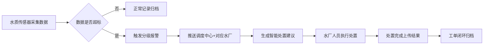

## 1. 产品概述

智慧水务综合管理平台是覆盖从水源到用户全流程的一体化水务运营管理系统，集成水源监测、供水调度、远程抄表、排水监控、污水处理、巡检管理六大核心业务模块，实现水务全链条数字化、智能化管理。

- **核心价值**：通过实时数据采集、智能分析预警、自动工单流转，提升水务运营效率，降低能耗成本，保障供水安全
- **目标用户**：水务集团调度中心人员、水厂组长、巡线员、系统管理员、市政部门、集团技术中心

---

## 2. 核心功能

### 2.1 用户角色与权限

| 角色 | 登录方式 | 核心权限 |
|------|----------|----------|
| 巡线员 | 账号登录 | 仅查看负责区域的巡检任务、上报异常、处理工单 |
| 水厂组长 | 账号登录 | 查看本厂水源数据、供水数据、污水处理数据，管理本厂工单 |
| 调度中心 | 账号登录 | 跨厂监控所有水厂、管网全局数据，下达调度指令 |
| 管理员 | 账号登录 | 全局配置报警阈值、阶梯水价、用户权限、规则设置 |

### 2.2 功能模块清单

1. **首页大屏**：实时总览（产水量、供水压力热力图、用水趋势、水质达标率、巡检完成率）、多维度筛选、报表导出
2. **水源监测**：各水源地实时水质参数（浊度、pH值、余氯、COD等）、分级超标报警、自动推送、处置建议生成
3. **供水调度**：历史用水量分析、实时管网压力监控、智能水泵启停组合、恒压供水控制、单泵能耗统计
4. **远程抄表**：用户水表自动采集、阶梯水价计费、账单生成、短信催缴、滞纳金计算、逾期关阀指令
5. **排水管网**：管网液位实时监控、预警线自动启动排涝泵、内涝风险警示推送市政
6. **污水处理**：各工艺段指标展示（COD、氨氮去除率等）、超标设备锁定、异常工单、超时升级至集团
7. **巡检管理**：区域任务自动生成、扫码打卡、照片上传、漏损/异常一键报修、工单分类指派、超时升级、修复对比图

### 2.3 页面详情

| 页面名称 | 模块名称 | 功能描述 |
|----------|----------|----------|
| 登录页 | 身份认证 | 账号密码登录、角色选择、验证码 |
| 首页大屏 | 数据总览卡片 | 今日产水量、当前压力、水质达标率、巡检完成率等KPI卡片 |
| 首页大屏 | 实时趋势图表 | 24小时产水量/用水量折线图、供水压力热力图 |
| 首页大屏 | 筛选导出 | 片区/时间/指标组合筛选器、月度运营分析与能耗成本报表一键导出 |
| 首页大屏 | 报警看板 | 实时滚动展示各级别报警信息、处置状态 |
| 水源监测页 | 水源地列表 | 各水源地状态卡片、核心参数展示 |
| 水源监测页 | 水质详情 | 实时水质参数仪表盘、历史趋势曲线、阈值配置 |
| 水源监测页 | 报警中心 | 分级报警列表（一级/二级/三级）、推送记录、处置建议 |
| 供水调度页 | 压力监控 | 管网压力热力图、实时压力值、压力趋势 |
| 供水调度页 | 水泵控制 | 智能启停建议、手动/自动模式切换、运行状态、单泵能耗 |
| 供水调度页 | 能耗统计 | 各泵能耗柱状图、总能耗趋势、同比环比分析 |
| 远程抄表页 | 用户列表 | 用户信息、表号、地址、当前读数 |
| 远程抄表页 | 账单管理 | 阶梯水价计算、账单明细、缴费状态 |
| 远程抄表页 | 催缴管理 | 短信催缴记录、滞纳金计算、关阀指令列表 |
| 排水管网页 | 液位监控 | 各监测点液位实时数据、预警线标识 |
| 排水管网页 | 排涝控制 | 排涝泵状态、自动/手动控制、运行记录 |
| 排水管网页 | 风险警示 | 内涝风险等级、推送市政记录、处置进度 |
| 污水处理页 | 工艺总览 | 各工艺段流程图、关键指标实时展示 |
| 污水处理页 | 异常工单 | 超标报警、设备锁定状态、工单处置流程 |
| 污水处理页 | 升级记录 | 超24小时升级集团技术中心记录、处理反馈 |
| 巡检管理页 | 任务中心 | 按区域自动生成巡检任务、任务状态 |
| 巡检管理页 | 打卡记录 | 扫码打卡、GPS定位、现场照片上传 |
| 巡检管理页 | 维修工单 | 漏损/异常一键报修、紧急程度分类、自动指派、超时升级、修复对比图 |
| 系统设置页 | 用户管理 | 用户账号、角色分配、区域划分 |
| 系统设置页 | 规则配置 | 报警阈值、阶梯水价、升级时限等参数配置 |

---

## 3. 核心流程

### 3.1 水质超标处置流程

水源地传感器实时采集数据 → 检测超标触发分级报警 → 推送至调度中心与对应水厂 → 系统生成处置建议 → 水厂人员处理并反馈 → 工单闭环归档

### 3.2 巡检报修升级流程

系统按区域自动生成巡检任务 → 巡线员扫码打卡 → 发现漏损/异常一键报修 → 工单按紧急程度分类指派 → 维修人员处理上传对比图 → 超48小时未闭环自动升级片区主管

### 3.3 欠费催缴流程

远程抄表自动采集读数 → 阶梯水价计算生成账单 → 用户逾期未缴 → 短信催缴+滞纳金 → 欠费超3个月 → 生成关阀指令推送外勤

---

## 4. 用户界面设计

### 4.1 设计风格

- **主色调**：深海蓝（#0A1628）+ 科技青（#00D4FF）作为主色，体现水务行业属性与科技感
- **辅助色**：预警黄（#FFB020）、报警红（#FF4D4F）、正常绿（#00E676）用于状态标识
- **背景风格**：深色数据大屏风格，搭配动态渐变光效与微弱科技网格纹理
- **字体方案**：数字展示使用等宽字体（JetBrains Mono），正文使用现代无衬线字体（PingFang SC）
- **布局**：顶部导航 + 左侧菜单 + 内容区三栏布局，首页大屏采用网格化卡片布局
- **图标**：使用 Lucide React 图标库，统一线性风格
- **动效**：数据数字滚动动画、卡片悬浮光效、报警闪烁、图表渐变填充

### 4.2 页面设计概览

| 页面名称 | 模块名称 | UI设计要点 |
|----------|----------|------------|
| 登录页 | 登录卡片 | 深色背景、科技感粒子动效、玻璃拟态登录卡片、品牌Logo展示 |
| 首页大屏 | 顶部数据条 | 滚动实时数据带、时间显示、报警数量角标 |
| 首页大屏 | KPI卡片组 | 渐变边框、实时数字滚动动画、状态指示灯、迷你趋势图 |
| 首页大屏 | 压力热力图 | 地图底图 + 监测点位 + 热力渲染 + 缩放交互 |
| 水源监测页 | 参数仪表盘 | 环形仪表盘、实时数值、阈值刻度线、超标变色 |
| 供水调度页 | 水泵控件 | 3D立体泵体造型、运行状态呼吸灯、能耗数字显示 |
| 巡检管理页 | 工单列表 | 紧急程度色条、状态标签、倒计时显示、操作按钮组 |
| 系统设置页 | 配置表单 | 分组标签页、滑块阈值配置、分段计价编辑区 |

### 4.3 响应式

- 设计优先级：桌面端优先（1920×1080为基准），适配1366×768~2560×1440分辨率
- 首页大屏支持全屏模式（F11）展示
- 左侧菜单可折叠收起，为小屏设备留出更多内容空间
- 触控交互优化：按钮最小高度40px，关键操作支持双击确认

---
