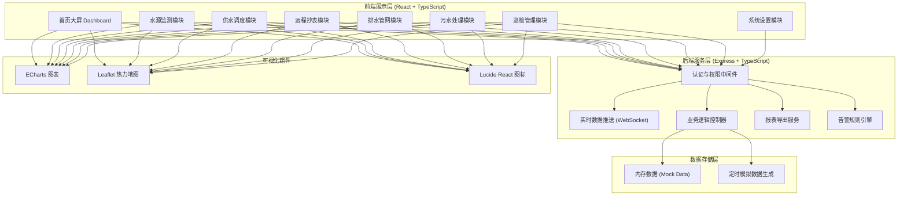
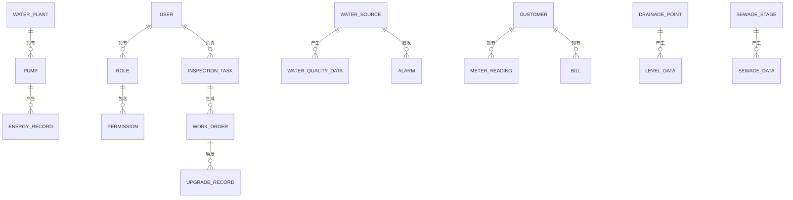

## 1. 架构设计



---

## 2. 技术描述

- **前端框架**：React 18 + TypeScript 5
- **构建工具**：Vite 5
- **样式方案**：TailwindCSS 3.4
- **状态管理**：Zustand 4
- **路由管理**：React Router DOM 6
- **后端服务**：Express 4 + TypeScript
- **实时通信**：WebSocket (ws库)
- **图表可视化**：ECharts 5
- **地图组件**：Leaflet 1.9 + react-leaflet
- **图标组件**：Lucide React
- **数据方案**：Mock 数据 + 定时模拟刷新（无需数据库）
- **UI组件**：自研业务组件库

---

## 3. 路由定义

| 路由路径 | 页面组件 | 权限要求 | 用途 |
|----------|----------|----------|------|
| `/login` | Login | 公开 | 登录认证 |
| `/dashboard` | Dashboard | 所有角色 | 首页大屏总览 |
| `/water-source` | WaterSource | 水厂组长/调度中心/管理员 | 水源监测 |
| `/water-supply` | WaterSupply | 水厂组长/调度中心/管理员 | 供水调度 |
| `/metering` | Metering | 调度中心/管理员 | 远程抄表与账单 |
| `/drainage` | Drainage | 调度中心/管理员 | 排水管网监控 |
| `/sewage` | Sewage | 水厂组长/调度中心/管理员 | 污水处理监控 |
| `/inspection` | Inspection | 所有角色 | 巡检管理 |
| `/settings` | Settings | 管理员 | 系统设置 |
| `/` | Redirect to /dashboard | - | 根路径重定向 |

---

## 4. 数据模型定义

### 4.1 实体关系图



### 4.2 核心数据类型

```typescript
// 用户与权限
type UserRole = 'inspector' | 'plant_leader' | 'dispatcher' | 'admin';

interface User {
  id: string;
  username: string;
  name: string;
  role: UserRole;
  area?: string;
  plantId?: string;
  avatar?: string;
}

// 水源与水质
interface WaterSource {
  id: string;
  name: string;
  location: string;
  plantId: string;
  status: 'normal' | 'warning' | 'alarm';
}

interface WaterQualityData {
  sourceId: string;
  timestamp: number;
  turbidity: number;
  ph: number;
  residualChlorine: number;
  cod: number;
  ammoniaNitrogen: number;
}

interface Alarm {
  id: string;
  sourceId: string;
  level: 1 | 2 | 3;
  type: string;
  parameter: string;
  value: number;
  threshold: number;
  timestamp: number;
  status: 'pending' | 'processing' | 'resolved';
  suggestion: string;
  pushedTo: string[];
}

// 供水与水泵
interface Pump {
  id: string;
  name: string;
  plantId: string;
  status: 'running' | 'stopped' | 'fault';
  mode: 'auto' | 'manual';
  power: number;
  currentEnergy: number;
  totalEnergy: number;
  startCount: number;
}

interface PressurePoint {
  id: string;
  name: string;
  lng: number;
  lat: number;
  pressure: number;
  status: 'normal' | 'low' | 'high';
}

// 抄表与账单
interface Customer {
  id: string;
  name: string;
  address: string;
  meterNo: string;
  phone: string;
  area: string;
}

interface MeterReading {
  customerId: string;
  reading: number;
  timestamp: number;
  isManual: boolean;
}

interface Bill {
  id: string;
  customerId: string;
  period: string;
  consumption: number;
  amount: number;
  lateFee: number;
  status: 'unpaid' | 'paid' | 'overdue' | 'shutoff';
  dueDate: string;
  reminders: number;
}

// 排水
interface DrainagePoint {
  id: string;
  name: string;
  lng: number;
  lat: number;
  level: number;
  warningLevel: number;
  alarmLevel: number;
  pumpStatus: 'idle' | 'running';
}

// 污水处理
interface SewageStage {
  id: string;
  name: string;
  plantId: string;
  order: number;
}

interface SewageData {
  stageId: string;
  timestamp: number;
  cod: number;
  codRemoval: number;
  ammoniaNitrogen: number;
  ammoniaRemoval: number;
  flow: number;
}

// 巡检与工单
type WorkOrderPriority = 'low' | 'medium' | 'high' | 'urgent';
type WorkOrderStatus = 'pending' | 'assigned' | 'processing' | 'upgraded' | 'closed';

interface InspectionTask {
  id: string;
  inspectorId: string;
  area: string;
  date: string;
  status: 'pending' | 'in_progress' | 'completed';
  checkPoints: CheckPoint[];
}

interface CheckPoint {
  id: string;
  name: string;
  lat: number;
  lng: number;
  checked: boolean;
  checkTime?: number;
  photos?: string[];
}

interface WorkOrder {
  id: string;
  type: 'leak' | 'equipment' | 'other';
  priority: WorkOrderPriority;
  status: WorkOrderStatus;
  description: string;
  location: string;
  reporterId: string;
  assigneeId?: string;
  photos: string[];
  repairPhotos?: string[];
  createdAt: number;
  closedAt?: number;
  upgradeCount: number;
}
```

---

## 5. 前端状态管理 (Zustand)

```typescript
// stores/authStore.ts - 认证与用户状态
// stores/alarmStore.ts - 报警数据状态
// stores/dashboardStore.ts - 大屏数据状态
// stores/inspectionStore.ts - 巡检与工单状态
```

---

## 6. 目录结构

```
├── api/                           # 后端 Express 服务
│   ├── src/
│   │   ├── index.ts               # 服务入口
│   │   ├── middleware/            # 中间件（鉴权等）
│   │   ├── routes/                # API 路由
│   │   ├── services/              # 业务逻辑
│   │   ├── mock/                  # Mock 数据与模拟生成
│   │   └── types/                 # 共享类型
│   └── tsconfig.json
├── src/                           # 前端 React 应用
│   ├── main.tsx
│   ├── App.tsx
│   ├── pages/                     # 页面组件
│   │   ├── Login.tsx
│   │   ├── Dashboard.tsx
│   │   ├── WaterSource.tsx
│   │   ├── WaterSupply.tsx
│   │   ├── Metering.tsx
│   │   ├── Drainage.tsx
│   │   ├── Sewage.tsx
│   │   ├── Inspection.tsx
│   │   └── Settings.tsx
│   ├── components/                # 可复用组件
│   │   ├── layout/                # 布局组件（Sidebar, Header）
│   │   ├── charts/                # 图表组件
│   │   ├── cards/                 # 卡片组件
│   │   └── common/                # 通用UI组件
│   ├── stores/                    # Zustand 状态管理
│   ├── hooks/                     # 自定义 Hooks
│   ├── utils/                     # 工具函数
│   ├── types/                     # TypeScript 类型
│   ├── mock/                      # 前端 Mock 数据
│   └── assets/                    # 静态资源
├── shared/                        # 前后端共享类型
├── package.json
├── vite.config.ts
├── tailwind.config.js
└── tsconfig.json
```
